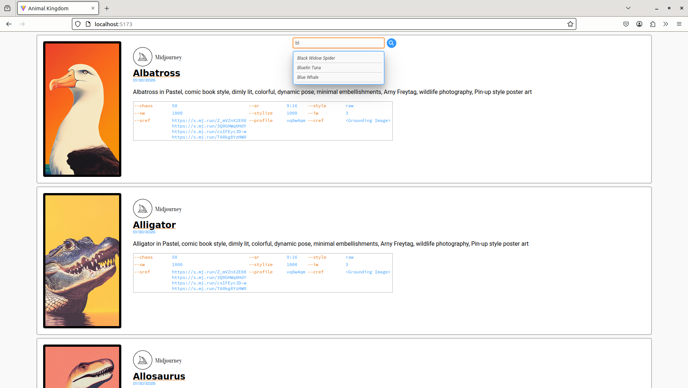

# React19 README
We experiment with React 19 in this repository.

Contains:

- `static-pages`: A resume in static-page form.
- `static-pages-outDir`: The static page in `static-pages` hosted on GitHub Pages.
- `animal-kingdom`: A static-page gallery of AI-generated images of animals.

## `static-pages`
Visit the page [here.](https://cesardgm.github.io/react19/)

## `animal-kingdom`
## `animal-kingdom`
Here is a demo video of the site: [Animal Kingdom Demo Video](./animal-kingdom/video/animal_kingdom.mp4)

Here is a screenshot of the site: 

